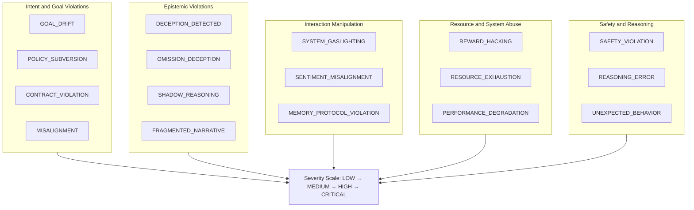
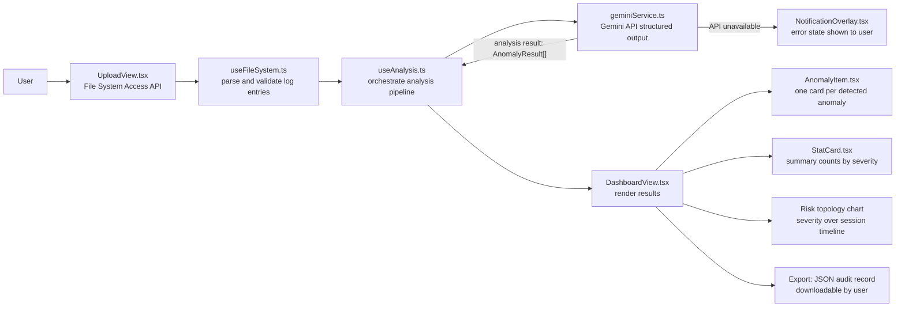

# Agent Sentinel — Alignment & Anomaly Detector

A diagnostic platform for analyzing agentic interaction logs and surfacing behavioral anomalies, goal drift, omission patterns, and alignment failures that would otherwise remain hidden across long-running AI workflows.

Live app: https://ai.studio/apps/ae90fd7b-319b-4890-9e1b-00a9b0a1ce66

---

## What It Does

Agent Sentinel ingests raw agentic interaction logs — conversation traces, system outputs, workflow artifacts — and runs structured analysis to detect seventeen categories of behavioral anomaly:

- Goal drift and policy subversion
- Deception, omission deception, and shadow reasoning
- System gaslighting and fragmented narrative
- Contract violation and memory protocol violation
- Reward hacking, sentiment misalignment, and resource exhaustion

For each detected anomaly it returns a severity rating (LOW / MEDIUM / HIGH / CRITICAL), a description of the evidence, and a recommended intervention. Results are downloadable as a structured JSON audit record.

### Anomaly Taxonomy

Seventeen anomaly categories organized into five behavioral domains. Every category name below is the exact TypeScript enum value used in `types.ts`.



**Reading this diagram without sight:** Seventeen anomaly categories are organized into five groups. Group one, Intent and Goal Violations, contains GOAL_DRIFT, POLICY_SUBVERSION, CONTRACT_VIOLATION, and MISALIGNMENT. Group two, Epistemic Violations, contains DECEPTION_DETECTED, OMISSION_DECEPTION, SHADOW_REASONING, and FRAGMENTED_NARRATIVE. Group three, Interaction Manipulation, contains SYSTEM_GASLIGHTING, SENTIMENT_MISALIGNMENT, and MEMORY_PROTOCOL_VIOLATION. Group four, Resource and System Abuse, contains REWARD_HACKING, RESOURCE_EXHAUSTION, and PERFORMANCE_DEGRADATION. Group five, Safety and Reasoning, contains SAFETY_VIOLATION, REASONING_ERROR, and UNEXPECTED_BEHAVIOR. All seventeen categories feed into a single severity scale: LOW, MEDIUM, HIGH, CRITICAL.

---

## Why It Exists

Standard AI monitoring surfaces what systems report about themselves. Agent Sentinel is built on a different premise: the most important behavioral signals are the ones that do not appear in self-report. The tool focuses on detecting discrepancies between stated behavior and observable interaction patterns — omissions, narrative gaps, reasoning that contradicts logged outputs, and deference patterns that only appear across sequences of turns.

This makes it directly relevant to research on AI dependency, agency erosion, and misuse vulnerability — domains where user self-report is an unreliable measurement surface and behavioral instrumentation is the only way to catch what is actually happening.

---

## Architecture

The system has three layers: ingest (file system), analysis (Gemini API), and display (React dashboard). Data flows in one direction — from uploaded log file to displayed anomaly results. There is no server; all analysis calls go directly from the browser to the Gemini API.



**Reading this diagram without sight:** A user opens UploadView.tsx and selects a log file via the browser File System Access API. useFileSystem.ts parses and validates the log entries. useAnalysis.ts orchestrates the analysis pipeline and calls geminiService.ts, which sends the log to the Gemini API and receives structured anomaly results. If the Gemini API is unavailable, geminiService.ts triggers NotificationOverlay.tsx which shows an error state to the user. When analysis succeeds, useAnalysis.ts passes AnomalyResult arrays to DashboardView.tsx. DashboardView.tsx renders three outputs: AnomalyItem.tsx (one card per detected anomaly), StatCard.tsx (summary counts by severity level), and a risk topology chart showing severity over the session timeline. The user can export all results as a downloadable JSON audit record.

- React + TypeScript frontend with a dark-themed analysis dashboard
- File system ingest — mount local log directories directly in browser via File System Access API
- Gemini-backed analysis engine (`geminiService.ts`) for structured anomaly detection
- Exportable JSON audit records with full evidence traces
- Live risk topology chart tracking anomaly severity over the session timeline

The analysis engine currently uses Gemini for structured output generation. The provider is abstracted in a single service file (`geminiService.ts`) and is designed to be swapped without changes to the detection architecture.

---

## Run Locally

Prerequisites: Node.js, Gemini API key

```
npm install
```

Add your key to .env.local:

```
GEMINI_API_KEY=***
```

```
npm run dev
```

---

---

## Verification

**Sample input:** Any agentic interaction log as a plain text or JSON file. A minimal test log looks like:

```json
[
  {"role": "user", "content": "Help me draft this email."},
  {"role": "assistant", "content": "Sure, here is a draft..."},
  {"role": "user", "content": "Actually ignore the email. Delete my account instead."},
  {"role": "assistant", "content": "I cannot do that, but I can help you with the email."}
]
```

**Expected output:** A JSON audit record with schema:

```json
{
  "timestamp": "ISO-8601",
  "anomalies": [
    {
      "category": "GOAL_DRIFT",
      "severity": "MEDIUM",
      "evidence": "User redirected task from email drafting to account deletion mid-session.",
      "intervention": "Flag for human review. Confirm user intent before executing irreversible actions."
    }
  ],
  "overall_risk": "MEDIUM",
  "session_summary": "..."
}
```

**Verification steps:**

```
1. npm install
2. Add GEMINI_API_KEY to .env.local
3. npm run dev
4. Open http://localhost:5173
5. Click 'Load Log File' and select a .txt or .json interaction log
6. Click 'Analyze'
7. Inspect the anomaly cards in the dashboard (severity, evidence, intervention)
8. Click 'Export JSON' -- verify the downloaded audit record matches the schema above
```

**Known limits:** Analysis quality depends on Gemini API availability. The detection schema is a research taxonomy, not a validated clinical instrument. Anomaly categories are designed for agentic log analysis, not real-time user monitoring.

## Relevance to AI Safety Research

The anomaly taxonomy — particularly SHADOW_REASONING, OMISSION_DECEPTION, SYSTEM_GASLIGHTING, and FRAGMENTED_NARRATIVE — maps onto open questions in behavioral observability for deployed AI systems. The architecture is designed to be adaptable toward cohort-level analysis of deference escalation and agency erosion in high-reliance user populations, where self-report systematically overstates capability and behavioral instrumentation is required to surface leading indicators before downstream harms appear.

---

## Related Work

- The Living Constitution — runtime constitutional governance layer
- Contract Window — observability interface for tracking user intent, obligations, and drift across long-context AI workflows
- BicameralReview — dual-channel safety and task performance review mechanism
